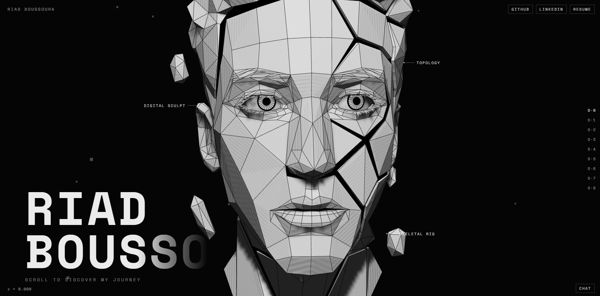

**Computer Vision R&D Engineer** based in Paris. I work at the boundary of deep learning, 3D simulation, and real-time perception systems.

Completed my final year internship at **GoPro**: built a Sim-to-Real pipeline that replaced a legacy 360° stitching algorithm with a custom PyTorch model, achieving >50% reduction in processing time.

---

## Work

| Role | Company | Period |
|---|---|---|
| Computer Vision R&D Engineer | GoPro | 2025 |
| Lead Founding Engineer / CTO | BargMe | 2023 - 2024 |
| Technical Educator, 3D & AI | SkillDino / InspirationTuts | 2022 - 2023 |

---

## Projects & Awards

**ASYEL: Sign Language Translation**
Gesture-to-speech pipeline using LSTMs on a custom motion-capture dataset.
`2nd Prize, National Innovation Competition (Ministry of Telecommunication)`

**Autonomous Fall Detection**
Edge AI safety system with skeleton tracking and human-in-the-loop verification.
`1st Prize, Google DevFest AI Hackathon · Featured on national TV`

**Real-Time Driver Monitoring (ADAS)**
Drowsiness detection via 3D facial mesh tracking, 468 landmarks, real-time.
`Judges' Favorite, Samsung Innovation Campus`

---

## Skills

**Computer Vision**

**Deep Learning**

**3D & Simulation**

**Engineering**

---

## Education

MSc AI & Computer Vision, Sorbonne Paris Nord *(Excellence Scholarship)*

MSc Computer Vision + BSc Software Engineering, USTHB *(Top of Class)*

AI & Data Science, Samsung Innovation Campus *(Top 30 Nationwide)*

---

Want to know more? **[Chat with my AI clone](https://riadboussoura.com)** — it knows my background, projects, and thinking.

---

[hello@riadboussoura.com](mailto:hello@riadboussoura.com) · [riadboussoura.com](https://riadboussoura.com) · [LinkedIn](https://linkedin.com/in/RiadBsr)
